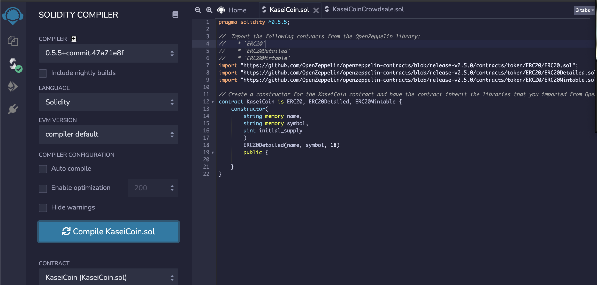
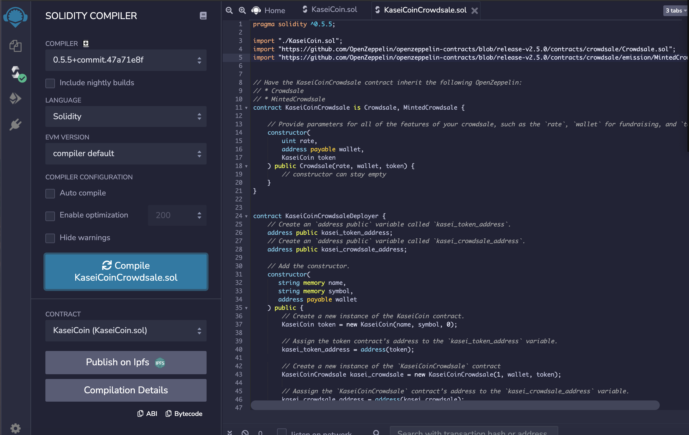
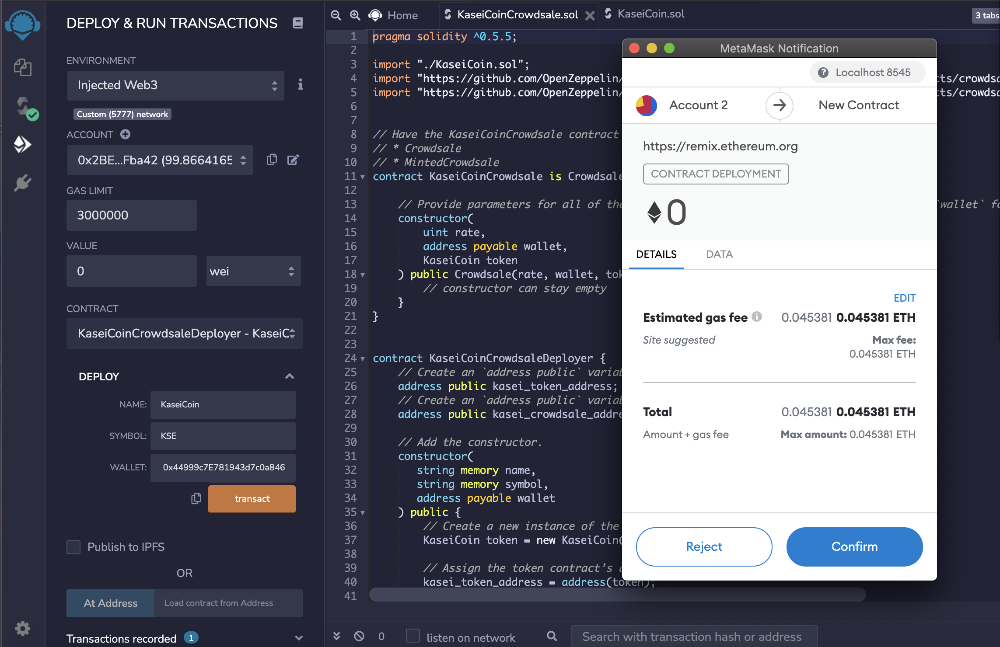
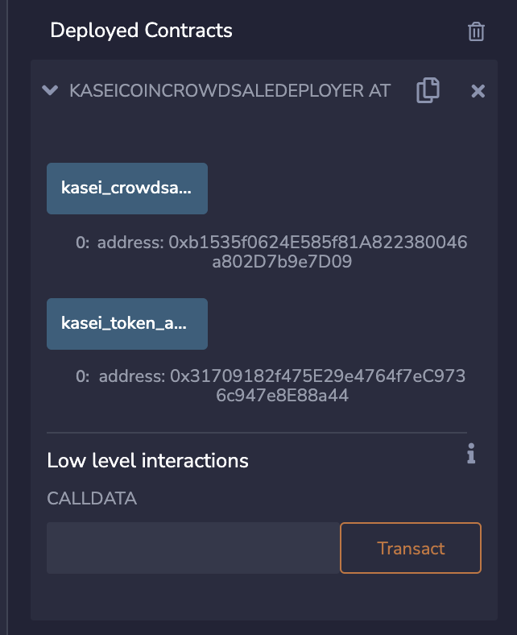
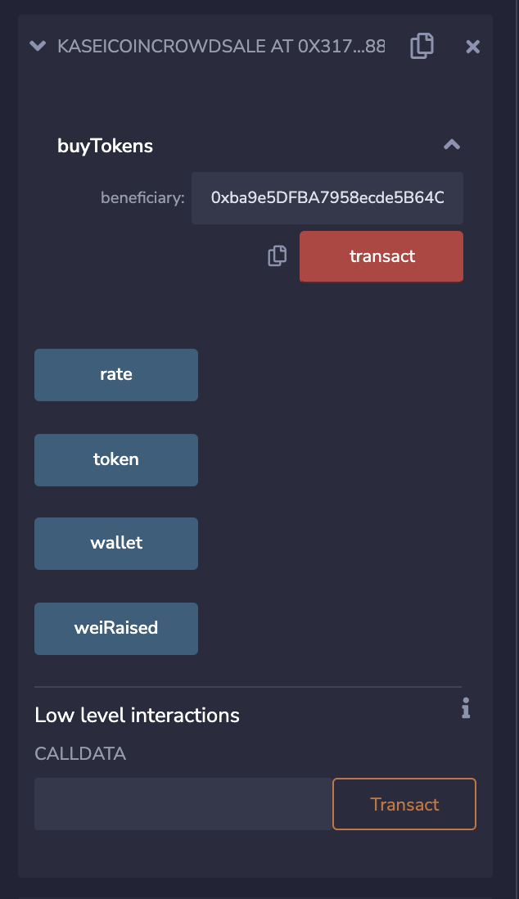
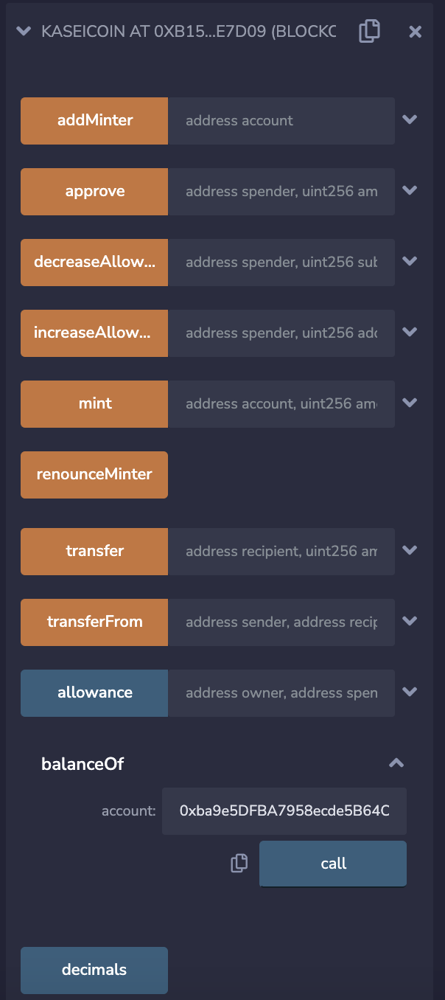

# Challenge-21

## Compile KaseCoin.sol

## Compile KaseCoinCrowdsale.sol

## Remix IDE is interacting with my local blockchain and MetaMask

## Deployed Crowdsale Deployer

## Deployed KaseiCoin Crowdsale

## Deployed KaseCoin

